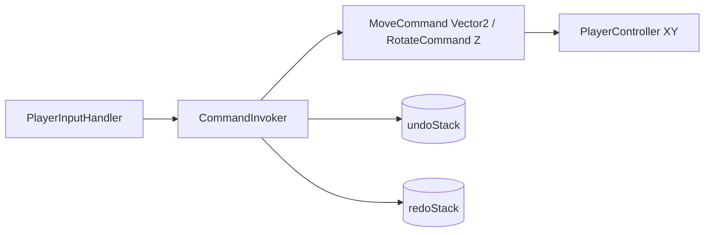

# Command Pattern Demo (2D) — Setup Unity & Thuyết trình 5 phút

## 1. Cấu trúc code

| File | Vai trò |
|------|---------|
| `Assets/_Game/Scripts/_Pattern/Command.cs` | Hợp đồng `Execute()` / `Undo()` |
| `Assets/_Game/Scripts/Gameplay/Player/PlayerController.cs` | Receiver — di chuyển / xoay trên mặt phẳng XY |
| `Assets/_Game/Scripts/Gameplay/Commands/MoveCommand.cs` | Concrete Command — `Vector2` direction |
| `Assets/_Game/Scripts/Gameplay/Commands/RotateCommand.cs` | Concrete Command — xoay quanh trục Z |
| `Assets/_Game/Scripts/Gameplay/Commands/CommandInvoker.cs` | Invoker — undo/redo stack |
| `Assets/_Game/Scripts/Gameplay/Commands/PlayerInputHandler.cs` | Client — đọc phím, tạo command |
| `Assets/_Game/Scripts/Gameplay/Commands/CommandDemoHUD.cs` | HUD tùy chọn (OnGUI) |

Luồng:

```
PlayerInputHandler → Command → CommandInvoker → PlayerController (XY, rotate Z)
```

---

## 2. Walkthrough setup Unity (2D)

### Bước 1 — Tạo scene 2D

1. Mở project `AGU301_G2`.
2. `File → New Scene` → chọn template **2D** (hoặc scene 2D có sẵn như `SampleScene`).
3. `File → Save As` → `Assets/Scenes/CommandPatternDemo.unity`.

> Dùng scene riêng. Trên `Player` **không** gắn `PlayerMovement` (script đó đọc axis liên tục, trùng demo).

### Bước 2 — Tạo Player 2D

1. Hierarchy: chuột phải → `2D Object → Sprites → Square` (hoặc `Create Empty` + `Sprite Renderer` + gán sprite).
2. Đổi tên `Player`.
3. Transform:
   - Position: `(0, 0, 0)`
   - Scale: `(1, 1, 1)` (có thể `(0.8, 0.8, 1)` cho dễ nhìn).
4. `Add Component` → `Player Controller`.
5. Inspector `Move Step` = `1`.

(Tùy chọn) `Rigidbody 2D` → Body Type **Kinematic** nếu sau này cần va chạm; demo bước từng ô chỉ cần `Transform`.

### Bước 3 — Tạo GameManager

1. Hierarchy: `Create Empty` → tên `GameManager`.
2. Add Component: `Command Invoker`, `Player Input Handler`.
3. (Tùy chọn) `Command Demo HUD`.

### Bước 4 — Gán reference

Chọn `GameManager`:

| Component | Field | Kéo object |
|-----------|-------|------------|
| Player Input Handler | Player | `Player` |
| Player Input Handler | Command Invoker | `GameManager` |
| Command Demo HUD | Player | `Player` |
| Command Demo HUD | Command Invoker | `GameManager` |

### Bước 5 — Camera 2D

1. Chọn `Main Camera`:
   - **Projection**: Orthographic (scene 2D mặc định đã Orthographic).
   - Position: `(0, 0, -10)`
   - Rotation: `(0, 0, 0)`
   - Size (Orthographic): `5`–`8` (zoom cho vừa Square).
2. Có thể thêm `Grid` hoặc nền màu để dễ thấy hướng (tùy chọn):
   - `2D Object → Tilemap` hoặc Sprite nền phía sau.

Không cần Directional Light cho sprite 2D thuần.

### Bước 6 — Kiểm tra trước Play

- [ ] Scene là **2D** (icon 2D trên Hierarchy / Camera Orthographic).
- [ ] `Player` có `PlayerController`, **không** có `PlayerMovement`.
- [ ] `GameManager` reference không `None`.
- [ ] Mở Console (`Ctrl+Shift+C`).

### Bước 7 — Play Mode

| Phím | Hành động (2D) |
|------|----------------|
| W | Lên (+Y) |
| S | Xuống (-Y) |
| A | Trái (-X) |
| D | Phải (+X) |
| Q | Xoay -90° (trục Z) |
| E | Xoay +90° (trục Z) |
| Z | Undo |
| Y | Redo |

Kỳ vọng: Square di chuyển từng ô trên XY, xoay quanh tâm; log Console; HUD hiển thị `(x, y)` và `Rotation Z`.

### Xử lý lỗi thường gặp

| Triệu chứng | Nguyên nhân | Cách sửa |
|-------------|-------------|----------|
| Không di chuyển | Reference `None` | Gán Player + Command Invoker |
| Di chuyển liên tục | Còn `PlayerMovement` | Remove component đó khỏi Player |
| Không thấy sprite | Camera Size quá nhỏ/lớn | Tăng/giảm Orthographic Size |
| W/S ngược | Không lỗi — Unity 2D: W = +Y (lên màn hình) | Giải thích khi demo |

---

## 3. Sơ đồ trình bày



---

## 4. Luồng thuyết trình 5 phút

### 0:00 – 1:00 | Vấn đề

**Nói:** Input gọi thẳng `player.Move()` trong game 2D sẽ dính logic, khó Undo/Redo.

**Làm:** Mở `PlayerInputHandler` (không `player.Move`) và `PlayerController` (`Vector2`, xoay Z).

---

### 1:00 – 2:00 | Command Pattern

**Nói:** Move / Rotate là object có `Execute` + `Undo`.

**Làm:** `Command.cs`, `MoveCommand` (`Vector2`), `RotateCommand` (góc Z).

---

### 2:00 – 3:00 | Demo Move 2D

**Làm (Play):** `W` → `W` → `D`; chỉ Console log Execute.

**Code:** `new MoveCommand(player, Vector2.up)` — nhấn mạnh không gọi gameplay trực tiếp.

---

### 3:00 – 4:00 | Undo / Redo

**Làm (Play):** `Z` hai lần, `Y` một lần, `Z` đến khi stack rỗng; mở `CommandInvoker` + HUD stack count.

---

### 4:00 – 5:00 | Rotate Z + Kết luận

**Làm (Play):** `E` `E`, Undo/Redo xoay; kết luận tách input / command / invoker.

---

## 5. Checklist trước khi present

- [ ] Scene 2D, Camera Orthographic
- [ ] Player = Sprite Square + `PlayerController` (không `PlayerMovement`)
- [ ] Reference GameManager đủ
- [ ] Đã test WASD, Q/E, Z/Y
- [ ] Mở sẵn: `Command.cs`, `PlayerInputHandler.cs`, `CommandInvoker.cs`

---

## 6. Câu hỏi phản biện

**Không gọi `Move()` trực tiếp?** — Tách input, dễ undo, dễ đổi nguồn lệnh (UI, AI).

**Command vs Event?** — Command có Undo và state; Event chỉ broadcast.

**Undo cần previous state?** — `_previousPosition` (Vector2), `_previousRotationZ`.

**Mọi hành động đều Command?** — Không; di chuyển realtime từng frame (như `PlayerMovement`) thường không cần.

**2D vs 3D trong demo?** — Cùng pattern; chỉ đổi `Vector2` + rotate Z thay vì `Vector3` + rotate Y.

---

## 7. Script files

```
Assets/_Game/Scripts/_Pattern/Command.cs
Assets/_Game/Scripts/Gameplay/Player/PlayerController.cs
Assets/_Game/Scripts/Gameplay/Commands/MoveCommand.cs
Assets/_Game/Scripts/Gameplay/Commands/RotateCommand.cs
Assets/_Game/Scripts/Gameplay/Commands/CommandInvoker.cs
Assets/_Game/Scripts/Gameplay/Commands/PlayerInputHandler.cs
Assets/_Game/Scripts/Gameplay/Commands/CommandDemoHUD.cs
```
